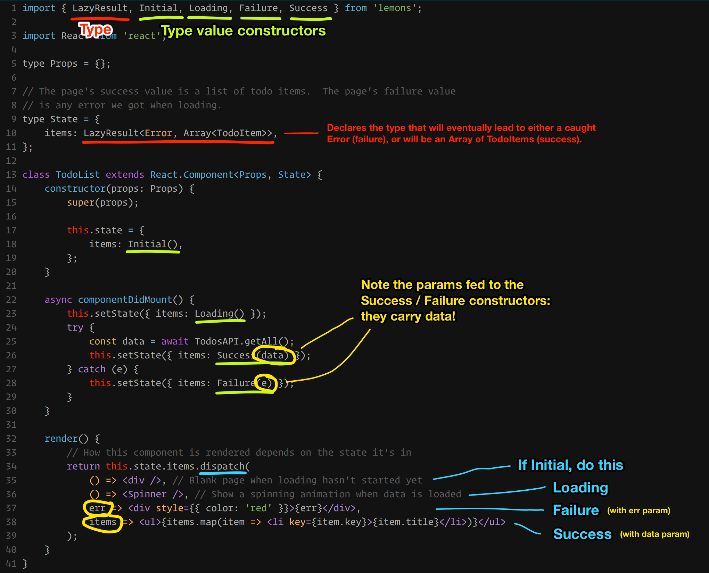

[](https://www.npmjs.com/package/lemons)
[](https://travis-ci.org/nvie/lemons.js)
[](https://coveralls.io/github/nvie/lemons.js?branch=master)

🍋 Common algebraïc data types for JavaScript, 'cause when life hands you lemons...

## Result

Pseudo-type:

    type Result<E, T> =
        | Ok T
        | Err E

Usage example:

```javascript
import { Result, Ok, Err } from 'lemons';

const r1: Result<string, number> = Ok(42);
r1.isOk()           // => true
r1.isErr()          // => false
r1.withDefault(99)  // => 42
r1.unwrap()         // => 42

const r2: Result<string, number> = Err('Oops');
r2.isOk()           // => false
r2.isErr()          // => true
r2.withDefault(99)  // => 99
r2.unwrap()         // throws 'Oops'
```


## LazyResult

Pseudo-type:

    type LazyResult<E, T> =
        | Initial
        | Loading
        | Failure E
        | Success T

Useful for state management that typically has an initial, loading, and
a failure/success outcome state, like page loading, or submitting a form.  The
following example shows how you would use the LazyResult as part of a React
app, but since ADTs are simple data structures, they work with any technology.

Annotated usage example:


